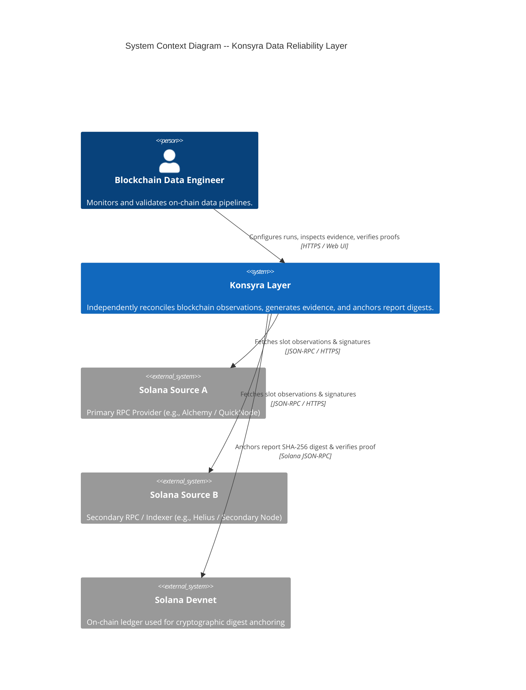

# Architecture Baseline Specification — Konsyra v0.1

> **Author:** PhaifferTech Architecture Team
> **Target Stack (Planned):** Python 3.12, FastAPI, PostgreSQL, Next.js, TypeScript, Solana Devnet
> **Architectural Pattern:** Modular Monolith
> **Status:** Baseline Specification (Phase 0 Spike Required)

---

## 1. Architectural Context & Scope

Konsyra is an open-source data reliability layer designed to validate blockchain-derived data independently across multiple infrastructure providers.

Downstream databases, analytical pipelines, and indexing services consume data from third-party RPC nodes and indexers. Even when underlying blockchain consensus remains intact, off-chain ingestion layers often introduce dropped transactions, inconsistent block observations, or parsing discrepancies.

Konsyra sits downstream of data providers, ingesting observations, performing deterministic set reconciliation, generating explicit evidence, and anchoring canonical validation report digests on Solana Devnet.

```
+-------------------+      +-------------------+
|  Solana Source A  |      |  Solana Source B  |
|  (RPC / Indexer)  |      |  (RPC / Indexer)  |
+---------+---------+      +---------+---------+
          |                          |
          +------------+-------------+
                       |
                       v
             +-------------------+
             |  Source Adapters  |
             +---------+---------+
                       |
                       v
             +-------------------+
             |  Quality Engine   |
             +---------+---------+
                       |
                       v
             +-------------------+
             |  Evidence Engine  |
             +---------+---------+
                       |
                       v
             +-------------------+
             |  Quality Report   |
             +----+---------+----+
                  |         |
                  v         v
        +-------------+  +-------------------+
        | Persistence |  |  Solana Devnet    |
        | (PostgreSQL)|  |  Proof Anchoring  |
        +-------------+  +-------------------+
```

---

## 2. Architectural Goals

1. **Provider Independence:** Domain logic and Quality Engine must remain completely isolated from provider-specific RPC schemas, HTTP implementations, and SDKs.
2. **Determinism:** Given identical normalized observations, the Quality Engine must yield identical check results, evidence payloads, canonical JSON, and SHA-256 digests.
3. **Explicit Failure States:** System execution failures must be explicitly separated from data quality validation failures.
4. **Auditability & Integrity:** Validation reports must be canonicalized and anchored on-chain for tamper-evident verification.
5. **Modularity:** High cohesion within domain modules with strict encapsulation to enable future scaling without premature microservice overhead.

---

## 3. Constraints

- **Hackathon Timeline:** Target delivery for Crypto World's Fair 2026 (October 12, 2026).
- **Network Scope:** Initial target blockchain is strictly **Solana** (Devnet for proof anchoring).
- **Zero AI Dependency:** Core validation engine must operate deterministically without reliance on LLMs or probabilistic heuristics.
- **Resource Limits:** Standard public RPC nodes enforce strict rate limits; adapters must batch and throttle requests.

---

## 4. System Context (C4 Level 1)



---

## 5. Container Architecture (C4 Level 2 — Planned Stack)

> [!NOTE]
> The container architecture represents the **planned production layout**. Phase 0 will validate core logic via standalone CLI scripts before building API, DB, or UI containers.

```mermaid
C4Container
    title Container Diagram -- Konsyra Modular Monolith

    Person(user, "Data Engineer", "Uses Web App to run validations")

    Container(web_app, "Next.js Web UI", "React / TypeScript", "Provides configuration UI, evidence diff viewer, and proof inspector.")
    Container(api_app, "FastAPI Application", "Python 3.12 / FastAPI", "Exposes REST endpoints, orchestrates validation runs, and handles proof submission.")

    ContainerDb(postgres_db, "PostgreSQL Database", "PostgreSQL 16", "Stores validation runs, observations, check results, canonical reports, and proof metadata.")

    ContainerModule(quality_module, "Quality & Evidence Engine", "Pure Python", "Runs deterministic checks, set reconciliation, and produces canonical reports.")
    ContainerModule(adapter_module, "Source Adapters", "Python / AsyncHTTP", "Fetches and normalizes provider observations into SlotObservation domain models.")
    ContainerModule(proof_module, "Solana Proof Adapter", "Python / Solana SDK", "Canonicalizes payloads, computes SHA-256, and submits Memo transactions to Devnet.")

    Rel(user, web_app, "Uses", "HTTPS")
    Rel(web_app, api_app, "API Calls", "JSON / HTTPS")
    Rel(api_app, postgres_db, "Reads / Writes", "SQL / AsyncPG")
    Rel(api_app, adapter_module, "Invokes collection", "Internal Call")
    Rel(api_app, quality_module, "Executes validation", "Internal Call")
    Rel(api_app, proof_module, "Triggers digest anchoring", "Internal Call")
```

---

## 6. Core Domain Model

The central aggregate root is `ValidationRun`.

```
ValidationRun (Aggregate Root)
│
├── ValidationRange (Value Object: start_slot, end_slot)
│
├── DataSource[] (Entities: source_id, provider_name, endpoint_hash)
│
├── Observation[] (Value Objects: SlotObservation per source)
│
├── CheckResult[] (Entities: check_type, status, summary)
│
├── Divergence[] (Entities: slot, target_field, source_a_value, source_b_value, diff)
│
├── QualityReport (Entity: schema_version, canonical_payload, sha256_digest)
│
└── Proof (Entity: network, transaction_signature, slot, block_time, verified)
```

### Domain Invariants
1. A `ValidationRun` must contain at least two distinct `DataSource` definitions.
2. `ValidationRange` requires `start_slot <= end_slot`.
3. Observations cannot be validated until collection across all defined sources is completed or explicitly marked as failed.
4. `QualityReport` SHA-256 digest must be computed exclusively from the canonical JSON representation of the payload.

---

## 7. Execution Status vs. Quality Status

To prevent ambiguity, Konsyra strictly separates infrastructure execution status from data quality results:

### `ExecutionStatus` (System Lifecycle)
- `PENDING`: Run created, awaiting execution.
- `COLLECTING`: Fetching observations from source adapters.
- `VALIDATING`: Running Quality Engine checks.
- `REPORT_READY`: Report generated and canonicalized.
- `ANCHORED`: SHA-256 digest successfully submitted to Solana Devnet.
- `COLLECTION_ERROR`: Infrastructure error during provider fetching (e.g., HTTP timeout, rate limit exceeded).
- `ANCHOR_ERROR`: Error during Solana Devnet transaction submission.

### `QualityStatus` (Data Integrity Result)
- `PASS`: All deterministic checks succeeded; zero discrepancies found across sources.
- `FAIL`: One or more deterministic checks detected divergence (e.g., missing transaction signature).
- `INCONCLUSIVE`: Observations incomplete due to provider availability (e.g., one provider returned skipped slot data).

> [!IMPORTANT]
> A run with `ExecutionStatus == ANCHORED` can legitimately possess a `QualityStatus == FAIL`. This represents a successfully executed validation run that accurately proved the existence of data divergence.

---

## 8. Source Adapter Boundary

Source Adapters normalize heterogeneous provider responses into a standard internal domain representation.

### Provider Normalization Boundary Flow
$$\text{Raw Provider Response (JSON-RPC)} \longrightarrow \text{[ Source Adapter ]} \longrightarrow \text{Normalized SlotObservation}$$

### Canonical `SlotObservation` Contract (Conceptual)
```python
class SlotObservation:
    source_id: str
    slot: int
    blockhash: str
    parent_slot: int
    block_time: int | None
    transaction_signatures: set[str]
    observed_at: str  # ISO-8601 UTC timestamp
```

*Note: skipped / unavailable / provider-error observation status semantics will be determined during Phase 0.*

The Quality Engine interacts **exclusively** with `SlotObservation` objects and has zero knowledge of underlying HTTP clients, API keys, or provider SDKs.

---

## 9. Quality Engine

The Quality Engine is a pure, deterministic Python module. It accepts normalized observations from multiple sources and applies configured checks.

```
Normalized Observations ──> [ Quality Engine ] ──> Check Results + Explicit Evidence
```

### Supported MVP Checks
1. **Completeness:** Ensures every slot in `[start_slot, end_slot]` has a corresponding observation for each provider.
2. **Uniqueness:** Ensures no duplicate transaction signatures exist within a single slot observation.
3. **Freshness:** Assesses timestamp drift between block timestamps and collection time.
4. **Reconciliation (Core Check):** Computes set differences between transaction signature sets:
   $$\text{Diff}_{A \setminus B} = \text{Signatures}_A \setminus \text{Signatures}_B$$
   $$\text{Diff}_{B \setminus A} = \text{Signatures}_B \setminus \text{Signatures}_A$$

---

## 10. Evidence Model

When reconciliation flags divergence, the Evidence Engine produces explicit, machine-readable evidence:

```json
{
  "slot": 421928383,
  "check_type": "RECONCILIATION",
  "status": "FAIL",
  "divergence": {
    "source_a_id": "rpc-alchemy-mainnet",
    "source_b_id": "rpc-quicknode-mainnet",
    "source_a_signature_count": 184,
    "source_b_signature_count": 182,
    "missing_in_source_a": [],
    "missing_in_source_b": [
      "5K8X9p2mN3vR4wL5q6t7u8v9w0x1y2z3a4b5c6d7e8f9g0h1i2j3k4l5m6n7o8p9",
      "3X9P2mL5q6t7u8v9w0x1y2z3a4b5c6d7e8f9g0h1i2j3k4l5m6n7o8p9q0r1s2t3"
    ]
  }
}
```

---

## 11. Quality Report Structure

The `QualityReport` decouples volatile metadata from the canonical hash payload:

```json
{
  "report_schema_version": "0.1.0",
  "validator_version": "0.1.0-alpha",
  "network": "solana-mainnet",
  "validation_range": {
    "start_slot": 421928380,
    "end_slot": 421928385
  },
  "sources": [
    { "source_id": "rpc-alchemy-mainnet", "provider_name": "Alchemy" },
    { "source_id": "rpc-quicknode-mainnet", "provider_name": "QuickNode" }
  ],
  "summary": {
    "execution_status": "REPORT_READY",
    "quality_status": "FAIL",
    "total_slots_validated": 6,
    "divergent_slots_count": 1
  },
  "checks": [ ... ],
  "evidence": [ ... ]
}
```

---

## 12. Canonicalization Scheme

To achieve deterministic hashing across different runtimes and languages, payload canonicalization follows **RFC 8785 (JSON Canonicalization Scheme - JCS)**:

$$\text{QualityReport Payload} \longrightarrow \text{JCS Normalization (RFC 8785)} \longrightarrow \text{UTF-8 Bytes} \longrightarrow \text{SHA-256 Digest}$$

- Keys are lexicographically sorted by Unicode code point.
- Whitespace between tokens is removed.
- Double-precision floats and numbers follow standardized string formatting.
- Hashing method: **SHA-256**.

*Note: Canonicalization details will be empirically verified during Phase 0.*

---

## 13. Solana Proof Mechanism

To prove report existence and integrity, Konsyra anchors the 32-byte SHA-256 digest on **Solana Devnet**.

```
Canonical Payload ──> SHA-256 Digest ──> Solana Transaction (Memo Program) ──> Solana Devnet
```

### On-Chain Anchor Standard (Candidate / Proposed)
- **Program:** Candidate mechanism using Solana Memo Program (`MemoSqs4gqABAXKb96qnH8TysNcWxMyWCqXgDLGmfcY`) or minimal custom memo instruction payload (TO BE VALIDATED DURING PHASE 0).
- **Instruction Payload Format (Candidate):** `KONSYRA:v0.1:<SHA256_HEX_DIGEST>` (TO BE VALIDATED DURING PHASE 0).
- **Verification:** Anyone can fetch the Devnet transaction by signature, extract the memo string, and verify that it matches the SHA-256 digest of the local Quality Report.

> [!IMPORTANT]
> **Integrity vs. Truth Principle:**
> The Solana proof guarantees that *this specific report existed in this exact state at this block timestamp*. It does NOT guarantee that the external RPC nodes observed absolute protocol truth.

---

## 14. Planned Persistence Schema (Conceptual)

The relational schema strictly maps domain aggregate boundaries:

- `validation_runs`: ID, execution_status, quality_status, start_slot, end_slot, created_at, updated_at.
- `validation_sources`: ID, validation_run_id, source_identifier, provider_name.
- `slot_observations`: ID, validation_run_id, source_id, slot, blockhash, block_time, tx_count, status.
- `check_results`: ID, validation_run_id, check_type, status, summary_json.
- `divergences`: ID, validation_run_id, slot, source_a_id, source_b_id, evidence_json.
- `quality_reports`: ID, validation_run_id, schema_version, canonical_json, sha256_digest.
- `proofs`: ID, validation_run_id, network, tx_signature, slot, memo_payload, verified.

---

## 15. Planned REST API Contracts

### `POST /api/v1/validations`
Initiates a new validation run.
- **Request:** `{ "start_slot": 421928380, "end_slot": 421928385, "source_ids": ["source-a", "source-b"] }`
- **Response:** `{ "validation_id": "val_12345", "execution_status": "PENDING" }`

### `GET /api/v1/validations/{id}`
Fetches status summary.
- **Response:** `{ "validation_id": "val_12345", "execution_status": "REPORT_READY", "quality_status": "FAIL" }`

### `GET /api/v1/validations/{id}/report`
Retrieves full canonical Quality Report.

### `POST /api/v1/validations/{id}/anchor`
Triggers digest anchoring on Solana Devnet.
- **Response:** `{ "tx_signature": "5K8...", "network": "solana-devnet", "execution_status": "ANCHORED" }`

### `GET /api/v1/proofs/{signature}`
Retrieves on-chain transaction proof details and verifies digest match.

---

## 16. Security & Credential Isolation

1. **Provider Keys:** API keys for commercial RPCs must reside exclusively in backend environment variables (`.env`). They are never exposed to the frontend or embedded in reports.
2. **Secrets Hygiene:** `.env` is explicitly ignored in `.gitignore`. Only `.env.example` templates may be committed.
3. **Wallet Isolation:** The Devnet fee-payer keypair used for proof anchoring must be a dedicated, isolated test keypair with zero mainnet funds.
4. **No Sensitive Data in Reports:** Evidence payloads contain public blockhashes, slot numbers, and transaction signatures. Provider credentials or internal API tokens are strictly excluded from reports.

---

## 17. Testing Strategy

```
  [ E2E Tests ]         -> Full flow (Web -> API -> Quality Engine -> Devnet Proof)
 [ Integration Tests ]  -> Source Adapters & Solana Devnet RPC submitter
[ Unit Tests ]          -> Quality Engine, JCS Canonicalization, Evidence Generation
```

- **Unit Tests:** Verify domain model invariants, signature set reconciliation logic, evidence payload construction, and canonical JCS hashing.
- **Contract Tests:** Validate raw RPC responses against expected adapter `SlotObservation` models.
- **Integration Tests:** Execute live RPC calls and Devnet memo anchoring.
- **E2E Tests:** Execute the 12-step Definition of Done workflow.

---

## 18. Demo Architecture

To prevent live hackathon presentation failures caused by external RPC node downtime, Konsyra implements two demo modes:

1. **LIVE Mode:** Executes live JSON-RPC calls against active Solana endpoints.
2. **DETERMINISTIC DEMO FIXTURE Mode:** Replays captured Solana block data with a pre-configured transaction signature omission.

The Web UI must explicitly render a high-visibility badge indicating when `DETERMINISTIC DEMO FIXTURE` mode is active.

---

## 19. Architectural Decision Records (ADR Summary)

- **ADR-001:** Solana First Blockchain Target (`ACCEPTED`)
- **ADR-002:** Transaction Signature Set Per Slot as Primary Reconciliation Unit (`ACCEPTED`)
- **ADR-003:** Canonical JSON (RFC 8785 JCS) for Report Hashing (`PROPOSED`)
- **ADR-004:** Solana Devnet Memo Transaction Digest Anchoring (`PROPOSED`)
- **ADR-005:** Provider-Agnostic Source Adapter Boundary (`ACCEPTED`)
- **ADR-006:** Modular Monolith System Architecture (`ACCEPTED`)
- **ADR-007:** Strict Exclusion of AI / LLMs from Validation Core (`ACCEPTED`)
- **ADR-008:** Rejection of Custom Solana Indexer for MVP (`ACCEPTED`)
- **ADR-009:** Explicit Quality Status Over Arbitrary Numerical Quality Score (`ACCEPTED`)
- **ADR-010:** Devnet Isolated Network for Hackathon Proof Anchoring (`ACCEPTED`)

---

## 20. Known Architectural Risks

1. **RPC Memory Footprint:** Fetching large slot ranges (e.g., >1000 slots) via full `getBlock` queries may exhaust local memory; streaming/chunked collection will be required.
2. **Skipped Slot Discrepancies:** Solana cluster slot leaders occasionally skip slots. The Quality Engine must accurately parse protocol skipped slots to avoid false `FAIL` quality statuses.
3. **Devnet Rate Limits / Latency:** Devnet public RPCs experience periodic congestion; exponential backoff must be implemented in the proof adapter.

---

## 21. Open Questions (Phase 0 Technical Spike Deliverables)

- `[ ]` Validate JCS canonicalization performance and byte output consistency across Python environments (TO BE VALIDATED DURING PHASE 0).
- `[ ]` Confirm candidate transaction memo size limits and fee costs on Solana Devnet (TO BE VALIDATED DURING PHASE 0).
- `[ ]` Measure response times and payload sizes for `getBlocks` vs `getBlock` with `transactionDetails="signatures"` RPC calls across 100 consecutive slots (TO BE VALIDATED DURING PHASE 0).
