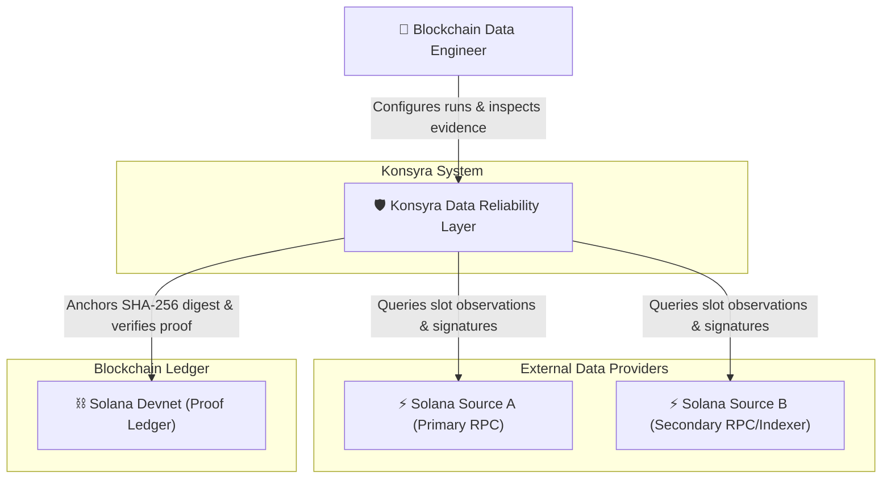
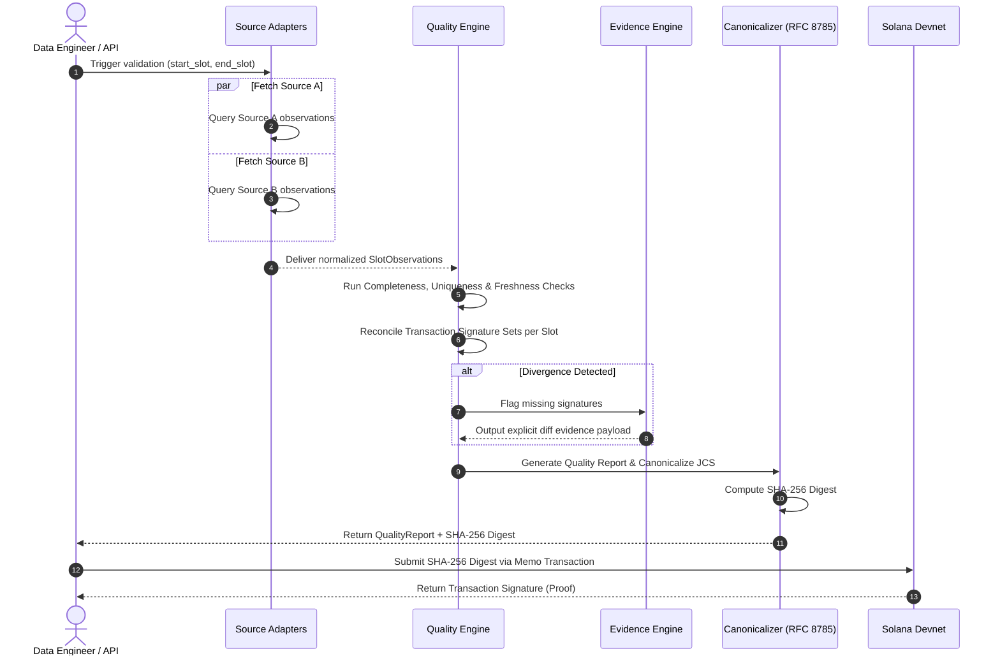
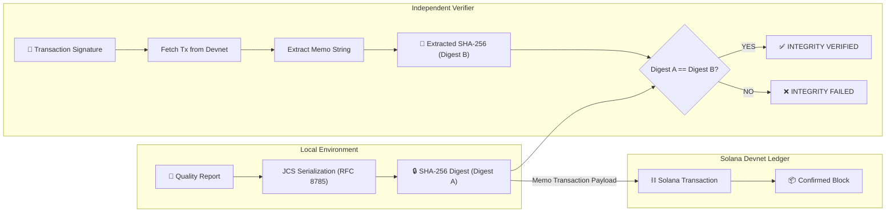

# Konsyra Architectural Diagrams

This directory contains visual architecture models for Konsyra using standard [Mermaid.js](https://mermaid.js.org/) notation. These diagrams are rendered directly within GitHub Markdown.

---

## 1. System Context Diagram (C4 Level 1)

Describes how Konsyra fits into the broader Web3 data ecosystem alongside engineers, data sources, and the Solana network.



---

## 2. Container Architecture Diagram (C4 Level 2 — Planned Stack)

Illustrates the internal modular monolith structure, component boundaries, and persistence layer.

```mermaid
graph TB
    subgraph Client Layer
        WebUI["🖥️ Next.js Web Application (React / TypeScript)"]
    end

    subgraph Backend Application (FastAPI Modular Monolith)
        API["🔌 REST API Router (FastAPI)"]

        subgraph Internal Domain Modules
            AdapterMod["🔌 Source Adapter Boundary"]
            QualityMod["⚙️ Quality & Evidence Engine"]
            ProofMod["⛓️ Solana Proof Module"]
        end
    end

    subgraph Storage
        Postgres[(🗄️ PostgreSQL Database)]
    end

    subgraph External Systems
        ProviderA["Source A RPC"]
        ProviderB["Source B RPC"]
        SolanaDevnet["Solana Devnet"]
    end

    WebUI -->|"REST / JSON"| API
    API -->|"Persists runs, reports & proofs"| Postgres
    API -->|"Triggers ingestion"| AdapterMod
    API -->|"Executes checks"| QualityMod
    API -->|"Triggers anchoring"| ProofMod

    AdapterMod -->|"JSON-RPC"| ProviderA
    AdapterMod -->|"JSON-RPC"| ProviderB
    ProofMod -->|"Memo Transaction"| SolanaDevnet
```

---

## 3. Validation Pipeline Flow Diagram

Illustrates the step-by-step lifecycle of a validation run from provider data ingestion to report canonicalization.



---

## 4. Solana Proof Anchoring & Verification Flow Diagram

Shows how cryptographic report digests are anchored on-chain and independently verified.

> [!NOTE]
> The Solana Memo Program is the **candidate / proposed** anchoring mechanism (see ADR-004). Final transaction and memo payload structure is **TO BE VALIDATED DURING PHASE 0**.


